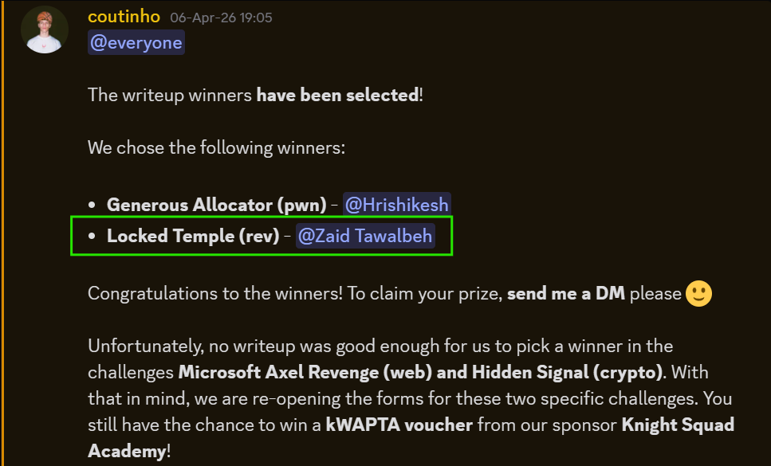

<!--

-->

  
# GeomRavage

### Cybersecurity & CTF Team

**We build. We break. We reverse. We exploit. We analyze. We compete.**

`Web` • `Crypto` • `Pwn` • `Reverse Engineering` • `Forensics` • `Misc`

---

## About Us

**GeomRavage** is a cybersecurity and Capture The Flag (**CTF**) team focused on learning, competing, building tools, solving challenges, and creating high-quality security content.

We aim to strengthen our skills across offensive and defensive security through teamwork, practice, research, and challenge development.

---

## Focus Areas

- **Web Exploitation**
- **Cryptography**
- **Binary Exploitation (Pwn)**
- **Reverse Engineering**
- **Digital Forensics**
- **Miscellaneous Challenges**
- **CTF Infrastructure & Automation**

---

## What We Do

- Compete in CTF competitions
- Publish writeups and technical notes
- Build internal tools and scripts
- Develop custom CTF challenges
- Collaborate on security research and practice

---

## Achievements & Writeups

### 🏆 Writeup Challenge Winner - Locked Temple

We are proud to feature one of our winning writeups from a Reverse Engineering challenge in the **[upCTF 2026](https://ctftime.org/event/3073)**:

**Challenge:** Locked Temple  
**Category:** Reverse Engineering  
**Writeup:** [Read the full writeup](https://github.com/0xAeterNova/upctf-writeups/blob/main/REV/Locked%20Temple/Write-Up.md)

This writeup demonstrates our approach to reverse engineering, analysis, problem solving, and documenting the full path from challenge understanding to final solution.

---

## Projects

> Coming soon.

<!--
- Jadara CTF
- CTF Writeups
- Challenge Development
- CTFd Customization
- Discord Integrations
- Internal Tools
-->

---

## Connect With Us

- **CTFtime:** https://ctftime.org/team/412925
- **Email:** geomravage@gmail.com

---

### GeomRavage

**Turning complexity into control.**

